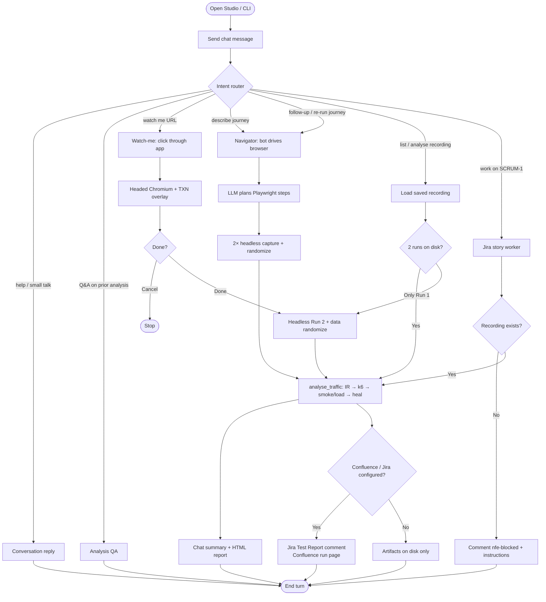
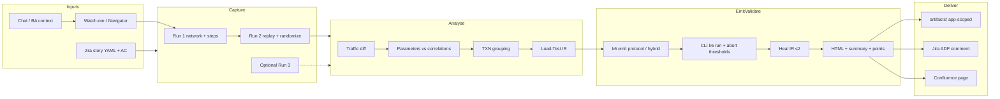
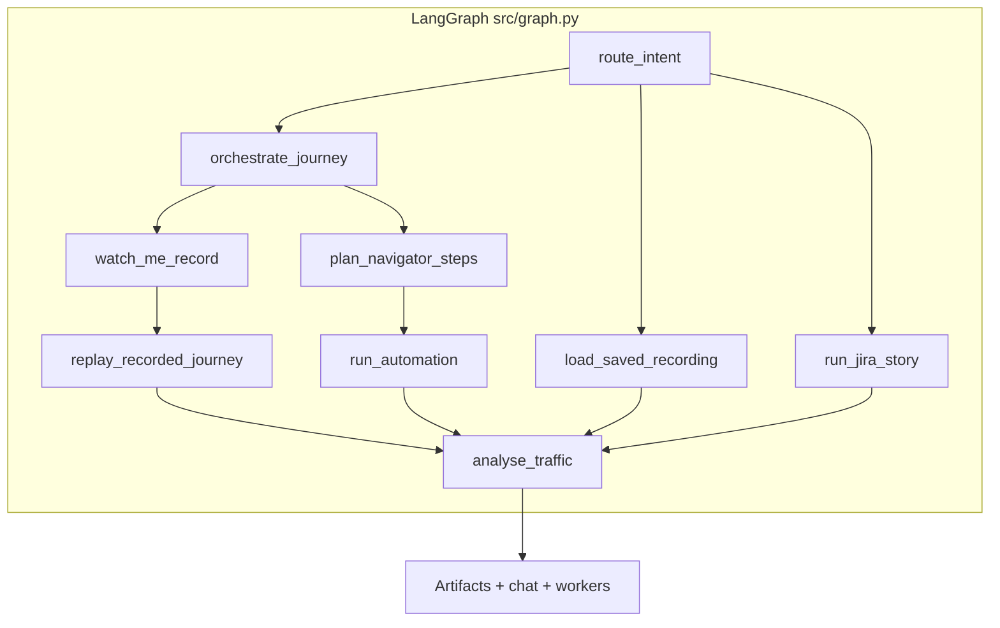
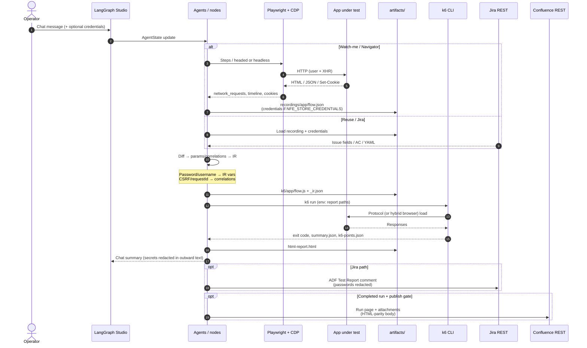
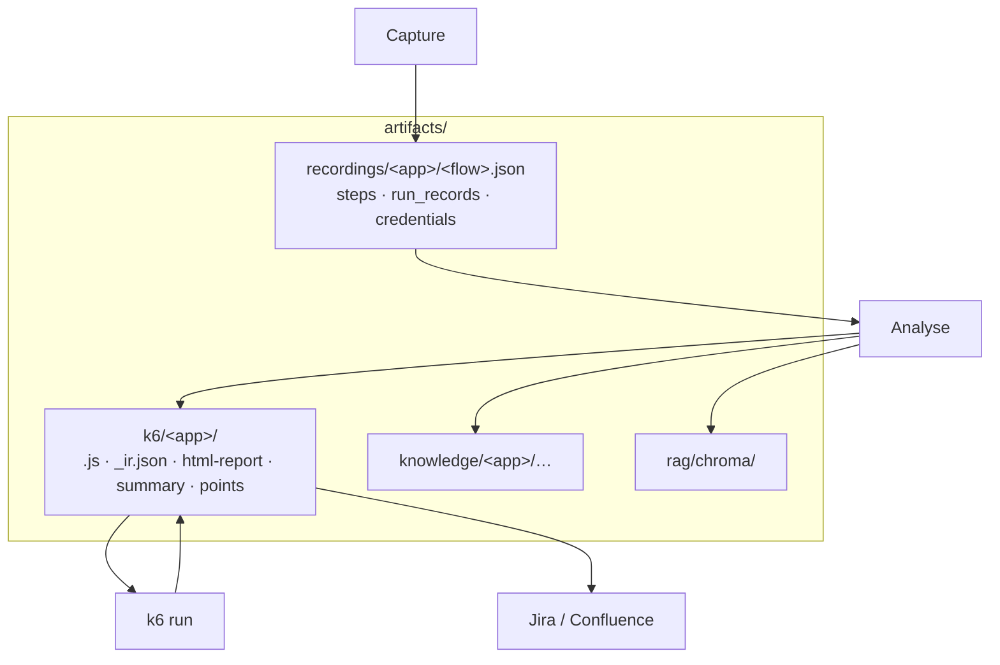

# NFE Agent — flow diagrams

Three views of how work moves through the system. Rendered as Mermaid (GitHub / most Markdown previews).

| Diagram | Purpose |
|---------|---------|
| [1. User flow](#1-user-flow) | What a person does in Studio chat |
| [2. End-to-end pipeline](#2-end-to-end-pipeline) | System stages from intent → publish |
| [3. Data transmission](#3-data-transmission) | What data moves between components |

Also: ASCII architecture in [`README.md`](../../README.md) · Agents: [`agents/overview.md`](../agents/overview.md) · Workers: [`workers/overview.md`](../workers/overview.md)

---

## 1. User flow

How an operator uses NFE from LangGraph Studio (or CLI).

**Typical happy paths**

| You say | What happens |
|---------|----------------|
| `watch me https://… username=… password=…` | You click; agent records → analyses → k6 |
| Free-text journey (no “watch me”) | Navigator plans + runs browser (`performance_analysis`) |
| Follow-up / “run that again” | `follow_up_analysis` → same orchestrate → Navigator path |
| `analyse saved recording` | Skip browser; re-run analyse from disk |
| `work on SCRUM-1` | Parse story → reuse recording → load run → Jira/Confluence |

**Jira without Studio chat:** poll/process from CLI — `.venv/bin/python -m src.integrations.jira_runner --issue SCRUM-1` or `--poll-once` (see [Jira integration](../workers/jira-integration.md)).

---

## 2. End-to-end pipeline

System stages from capture through delivery (deterministic script path highlighted).

**Design rule:** LLMs plan / classify / answer. IR → k6 emit, heal rules, Jira comments, and Confluence pages are **deterministic / REST** (no LLM-authored scripts).

### Also in the pipeline

Details that sit beside the Mermaid stages (not every edge is drawn above):

| Topic | What to know | Doc |
|-------|----------------|-----|
| **Hybrid k6** | Most TXNs are `k6/http`; SPA login may use `k6/browser` then cookie-sync back to protocol | [Load-Test IR → k6](load-test-ir-and-k6.md) |
| **Two self-heals** | (1) k6 IR heal after smoke 4xx (≤2); (2) Playwright selector heal during capture — different code paths | [Smoke + self-heal](smoke-and-self-heal.md) |
| **Abort thresholds** | Workload runs can stop early on catastrophic fail rate / p99 (`NFE_K6_ABORT_*`); default smoke keeps full failure set for heal | [Smoke + self-heal](smoke-and-self-heal.md#threshold-watcher-abortonfail) |
| **Jira CLI** | Chat `work on SCRUM-1` or `jira_runner --issue` / `--poll-once` | [Jira integration](../workers/jira-integration.md) |
| **LLM routing** | Optional Cursor SDK for planning; Gemini for extraction / self-heal / classify (see `.env.example`, `LLM_MODELS`) | Root [README](../../README.md) setup |
| **MCP** | All servers `enabled: false` by default; core path is Playwright+CDP + CLI `k6 run` | [Optional MCPs](../mcp/optional-mcps.md) |

---

## 3. Data transmission

What data crosses each boundary (credentials, network, IR, results).

### Data stores (app-scoped)

| Payload | Where it lives | Sent to LLM? | Sent to Jira/Confluence? |
|---------|----------------|--------------|---------------------------|
| Username / password | Recording + IR + k6 `vars` (when store on) | May appear in heal/script context | **No** — comment redaction |
| Session cookies | k6 cookie jar at runtime | No (redacted in artifacts network) | No |
| CSRF / requestId | IR correlations → script extracts | Advice only | Fail URLs may appear (no secrets) |
| Network HAR-like logs | `run_records` on disk | Truncated / classified | No raw dump |
| HTML report / summary | `artifacts/k6/<app>/` | No | Attached / linked when publish OK |

---

## Related docs

- [Load-Test IR → k6](load-test-ir-and-k6.md)
- [Smoke + self-heal](smoke-and-self-heal.md)
- [App artifacts & knowledge](app-artifacts-and-knowledge.md)
- [Jira integration](../workers/jira-integration.md)
- [Confluence publishing](../workers/confluence-publishing.md)
- [Security](../security/security.md)
